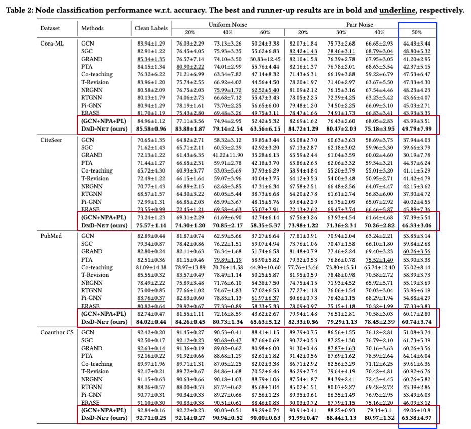

# KDD - 2024 Submission

## KDD - Rebuttal Response and Updated Results

We sincerely appreciate all reviewers for their valuable comments. Per their comments, we have conducted additional experiments with xxx, xxx, xxx and xxx, and the results are reported in the Tables as follows.

### More Experiments on High-level pair noise (50%)

1.1. The experiment results of all methods on four datasets with 50% pair noise are highlighted in the <font color=blue >BLUE</font> box.

1.2. Additional case study on replacing our DnD-NeT with GCN as the backbone are highlighted in the <font color=red >RED</font> box.

<p>
  
  <br />
</p>

***

## Divide and Denoise: Empowering Simple Models for Robust Semi-Supervised Node Classification against Label Noise

DnD-NeT offers a new solution to tackle the two problems from both the model architecture and algorithm perspectives, reviving the utility of message passing and pseudo labels in the problem of semi-supervised node classification with noisy labels. Specifically, DnD-NeT involves a label-noise robust GNN equipped with a reliable graph pseudo labeling algorithm, which can attain both effectiveness and efficiency when solving the studied problem. Extensive experiments demonstrate its state-of-the-art performance in semi-supervised node classification with varying levels of label noise.


<p>
  
  <br />
</p>

### Embedding space visulization on Cora-ML (left) and CiteSeer (right)
<p>
  
  
  <br />
</p>

To run the code:
```python
python main.py
```

Run on ogbn-arxiv:
```python
python main_arix.py
```
