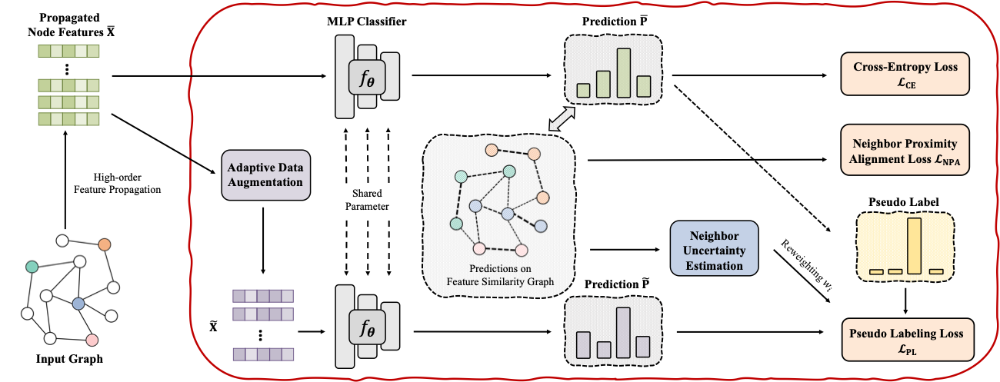
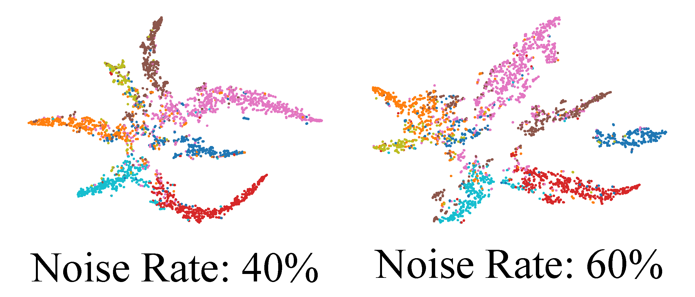
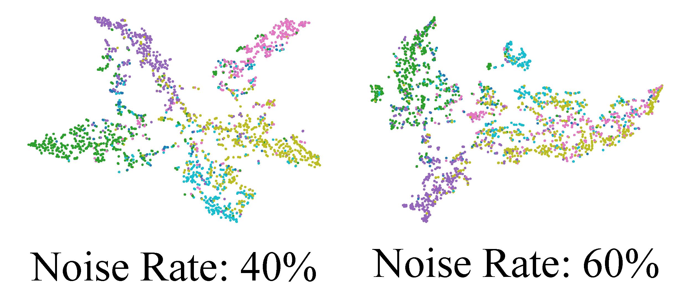

# KDD - 2024 Submission
## Divide and Denoise: Empowering Simple Models for Robust Semi-Supervised Node Classification against Label Noise
<p>
  
  <br />
</p>

DnD-NeT offers a new solution to tackle the two problems from both the model architecture and algorithm perspectives, reviving the utility of message passing and pseudo labels in the problem of semi-supervised node classification with noisy labels. Specifically, DnD-NeT involves a label-noise robust GNN equipped with a reliable graph pseudo labeling algorithm, which can attain both effectiveness and efficiency when solving the studied problem. Extensive experiments demonstrate its state-of-the-art performance in semi-supervised node classification with varying levels of label noise.

### Embedding visulization
<p>
  
  
  <br />
</p>

To run the code:
```python
python main.py
```

Run on ogbn-arxiv:
```python
python main_arix.py
```
